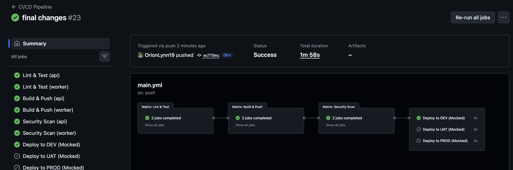
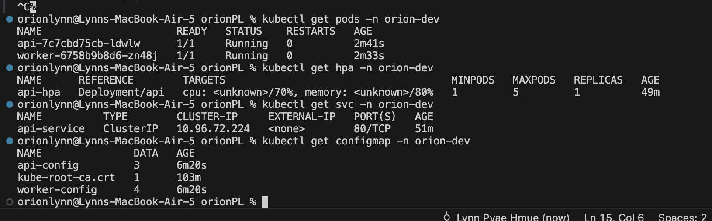

# Orion DevOps Assignment

## Architecture Overview
```
Developer pushes code
        ↓
GitHub Actions (CI/CD)
├── Lint & Test
├── Build & Push to GHCR
├── Security Scan (Trivy)
└── Deploy (Mocked + Manifest Validation)
        ↓
GitHub Container Registry
├── orion-api:dev/uat/latest
└── orion-worker:dev/uat/latest
        ↓
Kubernetes (kind locally / EKS in production)
├── orion-dev namespace
├── orion-uat namespace
└── orion-prod namespace
        ↓
Monitoring
├── Prometheus (scrapes metrics)
└── Grafana (visualizes metrics)
```

---

## Services

### API Service
- **Framework:** Node.js + Express.js
- **Port:** 8000
- **Endpoints:**
  - `GET /health` — returns service status
  - `GET /metrics` — Prometheus metrics
  - `GET /` — service info
- **Features:** Structured JSON logging, Prometheus metrics (request count, latency)

### Worker Service
- **Framework:** Node.js + node-cron
- **Port:** 9091 (metrics only)
- **Job:** Updates timestamps of today's records every minute (stubbed)
- **Features:** Structured JSON logging, Prometheus metrics (job success/failure, duration)

---

## Tech Stack

| Layer | Tool |
|---|---|
| API | Node.js 20 + Express.js |
| Worker | Node.js 20 + node-cron |
| Containers | Docker (multi-stage builds) |
| Orchestration | Kubernetes + Kustomize |
| CI/CD | GitHub Actions |
| Registry | GitHub Container Registry (GHCR) |
| Monitoring | Prometheus + Grafana |
| Security Scan | Trivy |
| Local Cluster | kind |

---

## Project Structure
```
orionPL/
├── api/                        # Express.js API service
│   ├── src/index.js
│   ├── tests/api.test.js
│   ├── Dockerfile
│   └── package.json
├── worker/                     # Background worker service
│   ├── src/index.js
│   ├── Dockerfile
│   └── package.json
├── k8s/
│   ├── base/                   # Shared Kubernetes manifests
│   │   ├── api-deploy.yaml
│   │   ├── api-service.yaml
│   │   ├── worker-deploy.yaml
│   │   ├── config.yaml
│   │   └── kustomization.yaml
│   ├── overlays/               # Environment specific configs
│   │   ├── dev/
│   │   ├── uat/
│   │   └── prod/
│   └── monitoring/             # Prometheus + Grafana manifests
│       └── monitoring.yaml
├── monitoring/                 # Docker Compose monitoring configs
│   ├── prometheus.yaml
│   └── alerts.yaml
├── .github/workflows/
│   └── main.yml                # CI/CD pipeline
├── docker-compose.yml
└── README.md
```

---

## Local Setup

### Prerequisites
- Docker Desktop
- Node.js 20+
- kubectl
- kind

### Run with Docker Compose
```bash
git clone https://github.com/OrionLynn19/orionPL
cd orionPL

docker compose up --build
```

| Service | URL |
|---|---|
| API | http://localhost:8000 |
| API Health | http://localhost:8000/health |
| Worker Health | http://localhost:9091/health |
| Prometheus | http://localhost:9090 |
| Grafana | http://localhost:3000 (admin/admin) |

### Run Tests
```bash
cd api
npm ci
npm test
```

---

## Kubernetes Setup (Local)
```bash
# Create cluster
kind create cluster --name orion

# Create namespaces
kubectl create namespace orion-dev
kubectl create namespace orion-uat
kubectl create namespace orion-prod
kubectl create namespace monitoring

# Deploy app
kubectl kustomize k8s/overlays/dev | kubectl apply -f -

# Deploy monitoring
kubectl apply -f k8s/monitoring/monitoring.yaml

# Verify
kubectl get pods -n orion-dev
kubectl get pods -n monitoring

# Port forward
kubectl port-forward svc/api-service 8000:80 -n orion-dev
kubectl port-forward svc/prometheus-service 9090:9090 -n monitoring
kubectl port-forward svc/grafana-service 3000:3000 -n monitoring
```

---

## CI/CD Pipeline

Pipeline triggers on push to `dev`, `uat`, and `main` branches.
```
push to dev  → lint → test → build (orion-api:dev)  → scan → validate DEV  → mock deploy DEV
push to uat  → lint → test → build (orion-api:uat)  → scan → validate UAT  → mock deploy UAT
push to main → lint → test → build (orion-api:latest)→ scan → validate PROD → mock deploy PROD

if qemu emulation hits error i want you to rerun the jobs 
```

### Pipeline Stages

| Stage | Description |
|---|---|
| Lint & Test | ESLint + Jest tests with coverage |
| Build & Push | Multi-platform Docker build pushed to GHCR |
| Security Scan | Trivy scans for CRITICAL/HIGH CVEs |
| Deploy (Mocked) | Validates K8s manifests + deployment summary |

### GitHub Secrets Required (for real EKS deploy)
```
AWS_ACCESS_KEY_ID
AWS_SECRET_ACCESS_KEY
AWS_REGION
```

---

## Environment Variables

| Variable | Service | Description | Default |
|---|---|---|---|
| `NODE_ENV` | Both | Environment name | `development` |
| `PORT` | API | Listen port | `8000` |
| `LOG_LEVEL` | API | Log level | `info` |
| `METRICS_PORT` | Worker | Metrics port | `9091` |
| `CRON_SCHEDULE` | Worker | Cron expression | `* * * * *` |
| `TZ` | Worker | Timezone | `UTC` |

### Per Environment
| Environment | NODE_ENV | LOG_LEVEL | CRON_SCHEDULE |
|---|---|---|---|
| DEV | development | debug | `* * * * *` (every minute) |
| UAT | uat | info | `* * * * *` (every minute) |
| PROD | production | warn | `0 0 * * *` (daily midnight) |

---

## Monitoring

### Prometheus Metrics

| Metric | Service | Description |
|---|---|---|
| `http_requests_total` | API | Total requests by method/route/status |
| `http_request_duration_seconds` | API | Request latency histogram |
| `worker_jobs_success_total` | Worker | Successful job completions |
| `worker_jobs_failure_total` | Worker | Failed job runs |
| `worker_job_duration_seconds` | Worker | Job execution duration |

### Alerts

| Alert | Severity | Condition |
|---|---|---|
| `APIHighErrorRate` | Critical | >5% 5xx errors over 5min |
| `APIDown` | Critical | Pod not responding for 1min |
| `APIHighLatency` | Warning | p95 latency >2s for 5min |
| `WorkerCrashLooping` | Critical | >5 job failures in 5min |
| `WorkerJobFailureRate` | Warning | Any job failure over 10min |
| `WorkerDown` | Critical | Worker not responding for 2min |

---

## Failure Scenarios

### 1. API crashes during peak hours
**What happens:**
- Liveness probe detects unresponsive pod
- Kubernetes automatically restarts it
- HPA scales out additional replicas based on CPU load
- PodDisruptionBudget ensures minimum 1 replica stays alive
- `APIHighErrorRate` alert fires → on-call notified

**Manual response:**
```bash
# Check logs
kubectl logs -n orion-prod -l app=api --previous

# If OOM increase memory limits
kubectl edit deployment api -n orion-prod

# If code bug rollback immediately
kubectl rollout undo deployment/api -n orion-prod
kubectl rollout status deployment/api -n orion-prod
```

---

### 2. Worker fails and infinitely retries
**What happens:**
- Kubernetes restarts worker with exponential backoff (10s → 20s → 40s)
- After 5 restarts `WorkerCrashLooping` alert fires
- Worker uses `Recreate` strategy so only one instance runs at a time
- No duplicate job processing risk

**Manual response:**
```bash
# Check crash logs
kubectl logs -n orion-prod -l app=worker --previous

# Check restart count
kubectl get pods -n orion-prod -l app=worker

# Fix root cause then push via CI/CD
# Cron will skip failed runs and resume on next schedule automatically
```

---

### 3. Bad deployment is released
**What happens:**
- Rolling update strategy keeps old pods alive until new pods pass readiness probes
- If new pods never become ready, rollout stalls
- Old pods continue serving traffic
- No downtime

**Manual response:**
```bash
# Immediate rollback
kubectl rollout undo deployment/api -n orion-prod

# Verify rollback successful
kubectl rollout status deployment/api -n orion-prod

# Check which version is running
kubectl describe deployment api -n orion-prod | grep Image
```

**Prevention:**
- Trivy security scan in CI blocks HIGH/CRITICAL CVEs
- UAT environment catches bugs before prod
- Readiness probes prevent bad pods from receiving traffic

---

### 4. Kubernetes node goes down
**What happens:**
- `topologySpreadConstraints` spreads pods across different nodes
- Losing one node doesn't kill all replicas
- Kubernetes reschedules pods from failed node onto healthy nodes
- PodDisruptionBudget prevents too many pods going down at once

**Manual response:**
```bash
# Check node status
kubectl get nodes

# Cordon failed node (prevent new pods scheduling)
kubectl cordon <node-name>

# Drain remaining pods safely
kubectl drain <node-name> --ignore-daemonsets --delete-emptydir-data

# On EKS — Auto Scaling Group replaces node automatically
# On kind — restart kind cluster
kind create cluster --name orion
```

---

## Note on Local Kubernetes Setup

Local kind cluster uses a single control-plane node for simplicity.
In production EKS, the cluster would have:
- 1 control plane node (managed by AWS)
- 2+ worker nodes across availability zones
- Pods spread across nodes via topologySpreadConstraints
- Real HPA metrics via metrics-server
- Auto Scaling Group replacing failed nodes automatically

## Screenshots

### CI/CD Pipeline Green


### Kubernetes Pods Running


### HPA Configured


### Prometheus Targets
(screenshots/prometheus-1.png)
(screenshots/prometheus-2.png)


(screenshots/dashboard.png)